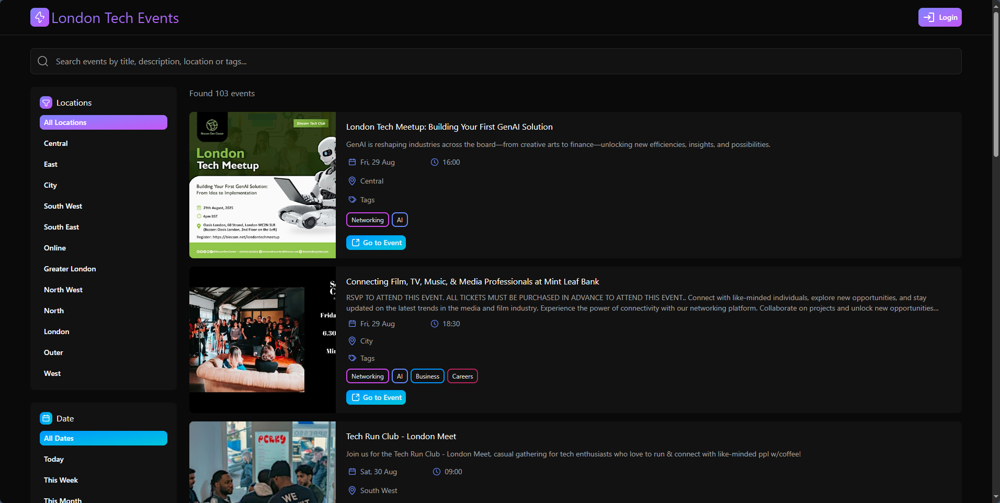
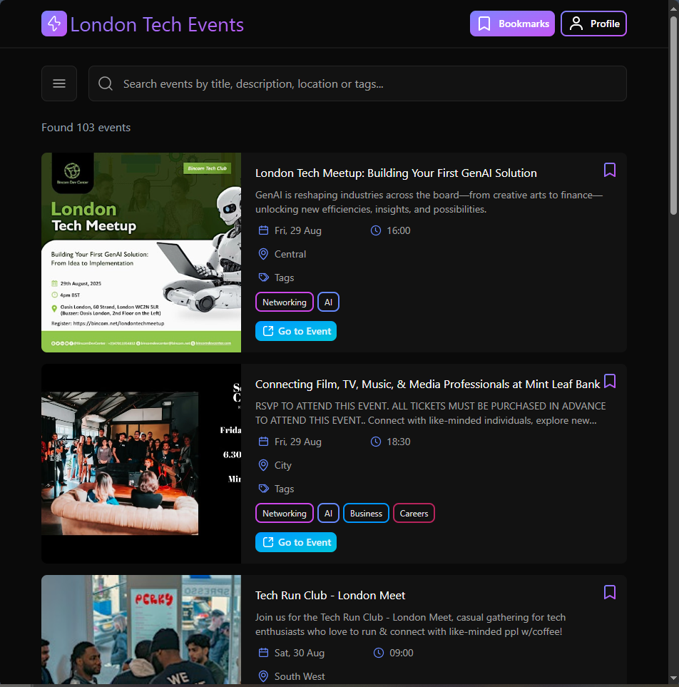
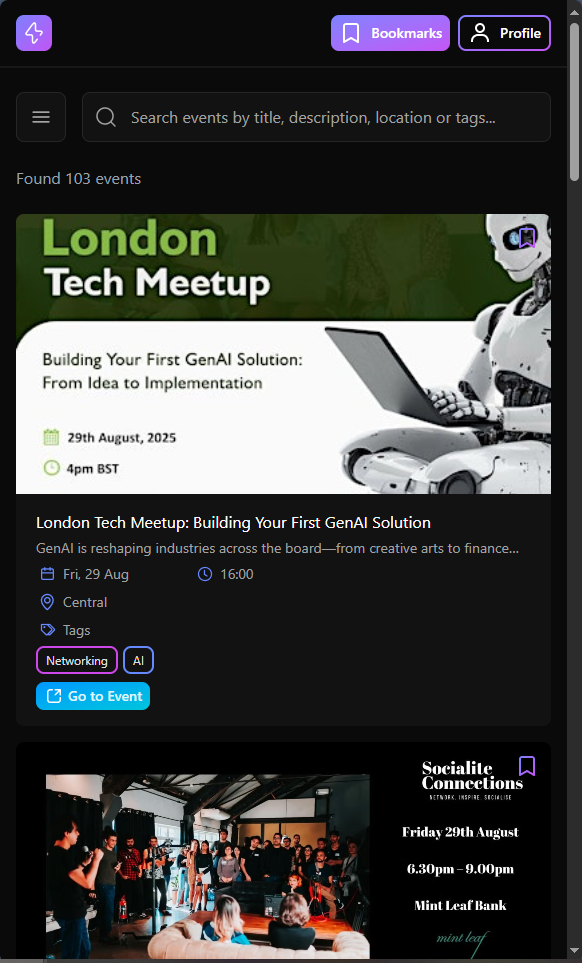
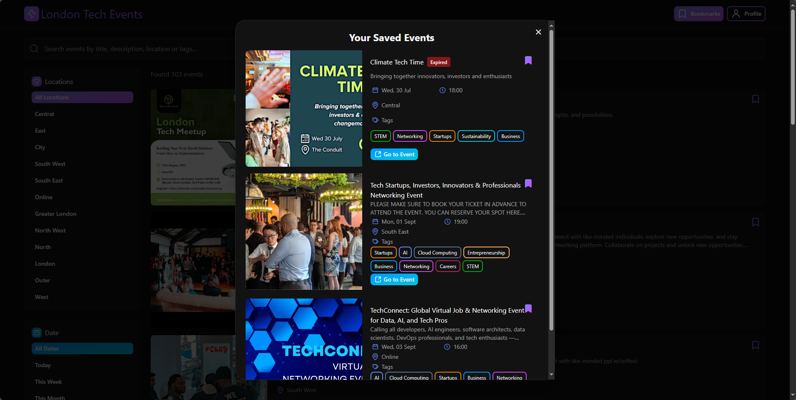

# 🏙️ London Tech Events

London Tech Events is a full-stack web application that aggregates, filters, and displays the latest tech-related events 
happening in London, using automated web scraping, intelligent tagging, and a clean, responsive frontend. Built with a modern tech stack, the platform helps tech enthusiasts discover and bookmark relevant meetups, talks, and networking events in the London area.

Visit here: (Add link)

## ✨ Features

- 🔍 **Aggregated Tech Events** 
  Gathers event data from platforms like Eventbrite and Meetup using Playwright-powered scraping and filters them for
  London-based tech events.
- 🧠 **Intelligent Tagging System**
  Events are tagged based on keyword analysis from titles and descriptions, bypassing the inconsistent tagging of
  user-generated events.
- 🗂️ **Advanced Filtering & Search**
  Filter events by date, location, or tags, and search events using a keyword search bar across titles and descriptions.
- 💾 **Supabase Integration**
  Events are stored in a Supabase PostgreSQL database, which powers the live data on the frontend.
- 🖥️ **Frontend with React + TailwindCSS**
  Fully responsive UI built with React and TailwindCSS.
  - Sidebar collapses into a burger menu on smaller devices
  - Reduced spacing and optimized layout for mobile and tablets
- 🔐 **Authentication**
  Users can sign up and log in with:
  - Email/password
  - OAuth providers: GitHub, Discord, and Google
- 📌 **Bookmarking System**
  Logged-in users can save/bookmark events for later access.
- ⚡ **Infinite Scrolling**
  Events are dynamically loaded as users scroll, improving performance and UX.

## 🛠️ Tech Stack

- **React**, **TailwindCSS**, **HTML5**, **CSS3** for Frontend structure and styling
- **Supabase**, **SQL**	for backend logic
- **Playwright (Node.js)** for scraper to gather events
- **Responsive design** using TailwindCSS breakpoints
- **Github** for version control
- **Github**, **Discord**, **Google** for Auth Providers

## 📸 Screenshots

### Desktop View

### Tablet View

### Phone View

### Bookmarked Events

## 🙋 Why I Built This

As a London-based developer passionate about local tech communities, I wanted to create a tool that makes discovering relevant, high-quality tech events easier and more centralized. I built this app from scratch to showcase my full-stack web development skills, including:
- Web scraping automation
- Data tagging and filtering
- Authentication & user state
- UI/UX design with responsiveness
- Integration of multiple modern frameworks and services, with a focus on React & Playwright.

## 📬 Contact
Mikail Deveden
Email: mdeveden95@gmail.com
[Github](https://github.com/MikailMichael)
[LinkedIn](https://www.linkedin.com/in/mikail-deveden/)
[Portfolio](https://mikaildeveden.co.uk/)
